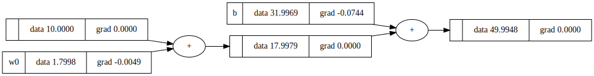

# BasiGrad

Inspired by [micrograd](!https://github.com/karpathy/micrograd)
## Simple Regression Model 

Training 
```python
from basicgrad import Value, Neuron

# Create Training Data
c2f = lambda x : float(1.8*x + 32) 
X = [[Value(float(i))] for i in range(-5,5)]
y = [Value(c2f(i)) for i in range(-5,5)]

# Init Model
model = Neuron(1, nonlin=False)
model.parameters()
lr = 0.01

# Training loop
while True:
    losss = []
    for x, yout in zip(X,y):
        pred = model(x)
        loss = (yout - pred)**2
        losss.append(loss)
    loss = sum(losss)
    if loss.data < 0.0001:
        break
    for pr in model.parameters():
        pr.grad = 0.0
    loss.backward()
    for pr in model.parameters():
        pr.data += (-lr * pr.grad)

```

Inference
```python
X = [Value(10)]
y = model(X)
print(y.summary()) # c2f(10) -> 50
```

